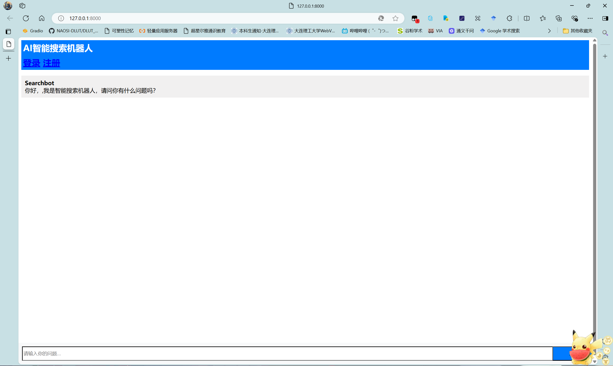
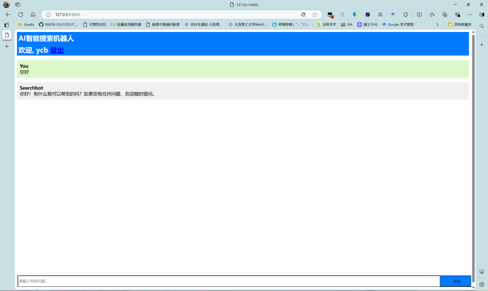
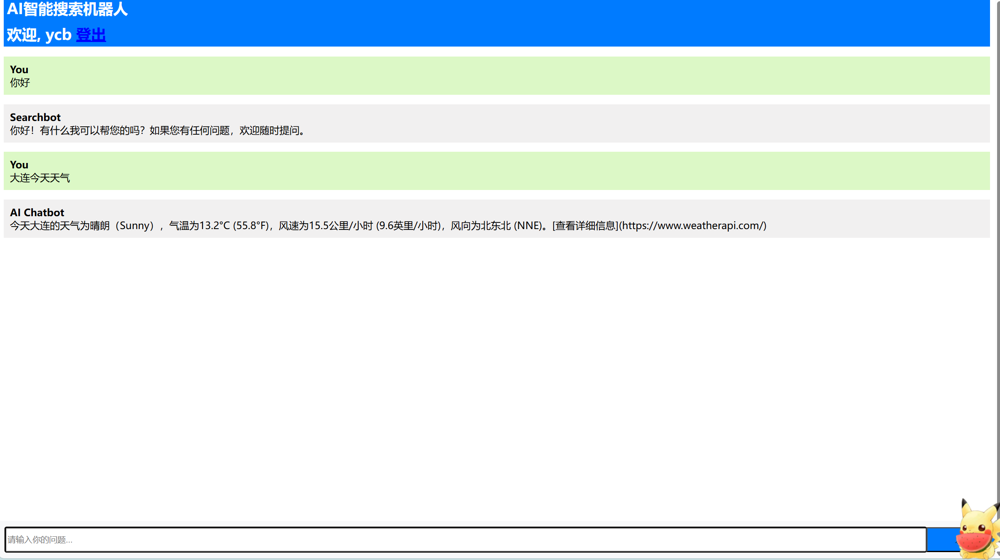
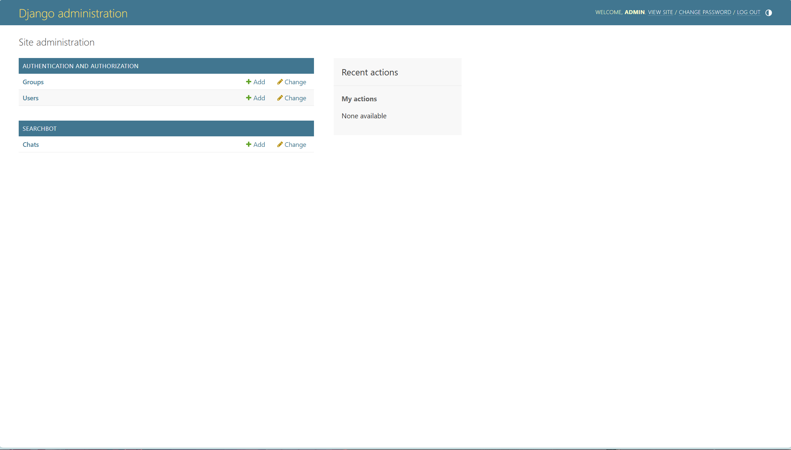
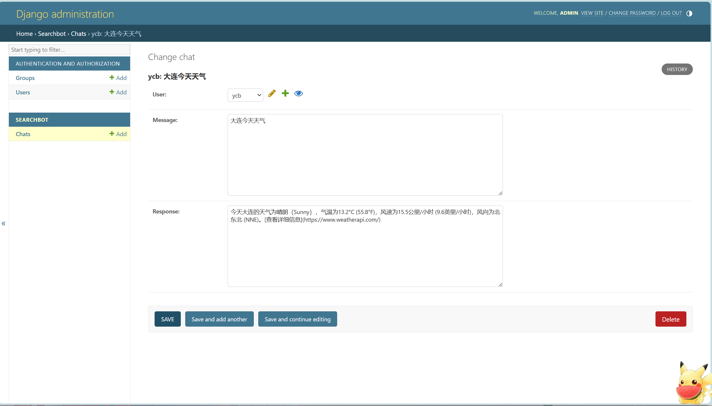
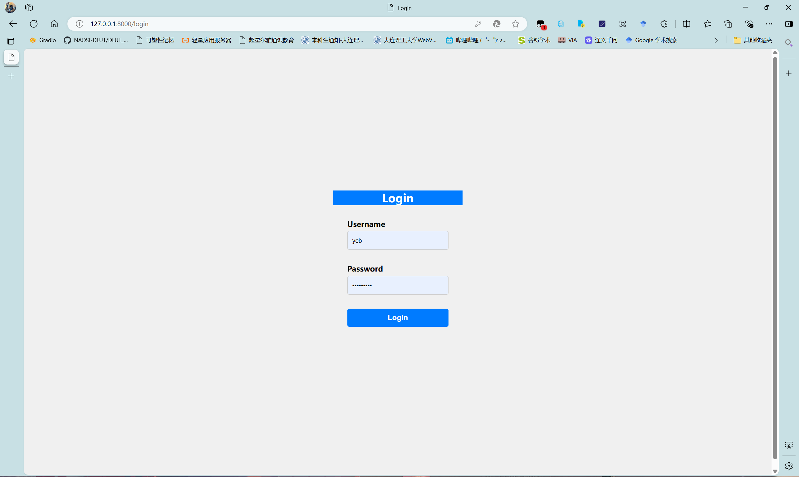

## 解决的问题：

当前搜索引擎不准确的问题

## 思路：

利用agent技术，对搜索到的结果大模型先进行比对，然后返回比较优质的几条回答。

## Run Me:

### 拉取我的项目：

```
git clone https://github.com/ssskeyi/search_bot.git
cd /django_searchbot
```

### 创建虚拟环境：

```shell
conda create -n searchbot
conda activate searchbot
conda install pip
pip install -r requirements.txt
```

### 准备阿里云的api key:

去官网自己开，然后放到环境变量里去

```shell
DASHSCOPE_API_KEY = sk-****
```

或者去修改agent.py中的代码：

```python
api_key=os.getenv("DASHSCOPE_API_KEY")
```

### 按照正常的Django项目运行即可

迁移数据库

```shell
python manage.py migrate
```

如果你更改了models.py文件的内容，执行以下命令

```shell
python manage.py makemigrations
```

创建管理员

```shell
python manage.py createsuperuser
```

运行（不了解Django的话直接激活环境运行下面的第一行命令即可）

```shell
(searchbot) PS E:\search_bot\django_searchbot> python manage.py runserver
Watching for file changes with StatReloader
Performing system checks...

System check identified no issues (0 silenced).
October 29, 2024 - 23:26:25
Django version 5.1.2, using settings 'django_searchbot.settings'
Starting development server at http://127.0.0.1:8000/
Quit the server with CTRL-BREAK.
```

## 补充：

在文件夹templates下有css和js文件夹，非本人编写，是下载的bootstrap-3.4.1进行的引用，因为国内通过CDN方式引用页面会响应很慢，所以改为本地引用。

## 功能展示：

### 初始界面

可以选择登录或者注册



在此时进行提问会弹出提示：“请先登录”


### 注册


### 登录


### 登录成功

会展示对应用户的历史问答记录，这些记录存储在数据库中



### 问答

调用后台agent代理进行推理，前端的提问和回答历史记录会保存到数据库中



### 后台推理过程

```shell
---等待LLM返回... ...


Today is 2024-10-30 08:10:08.
Considering our previous conversations:


你是一个智能搜索助手，对于用户提问的问题，你应该使用以下工具进行搜索，然后返回你认为合理的一个或者几个答案和原文链接：
tavily_search_results_json: 这是一个类似谷歌和百度的搜索引擎，搜索知识、天气、股票、电影、小说、百科等都是支持的。但是只支持英文输入的问题，会会返回5轮运行结果。s,args: [{"name": "query", "description": "search query to look up", "type": "string"}]

Use the following format:

Question: 你必须回答的用户问题
Thought: 你的思考过程
Action: the action to take (tavily_search_results_json)
Action Input: the input for the action
Observation: the result of the action
... (this Thought/Action/Action Input/Observation can be repeated zero or more times)
Thought: I now know the final answer
Final Answer: the final answer to the original input question

Begin!

Question: 大连今天天气


********花费时间:4.971489191055298......
---LLM返回---
Thought: 由于我需要使用英文进行搜索，因此需要将“大连今天天气”翻译成英文。翻译后的内容是“Dalian weather today”。接下来，我将使用tavily_search_results_json工具来获取今天的天气信息。
Action: tavily_search_results_json
Action Input: {"query": "Dalian weather today"}

---
---等待LLM返回... ...


Today is 2024-10-30 08:10:19.
Considering our previous conversations:


你是一个智能搜索助手，对于用户提问的问题，你应该使用以下工具进行搜索，然后返回你认为合理的一个或者几个答案和原文链接：
tavily_search_results_json: 这是一个类似谷歌和百度的搜索引擎，搜索知识、天气、股票、电影、小说、百科等都是支持的。但是只支持英文输入的问题，会会返回5轮运行结果。s,args: [{"name": "query", "description": "search query to look up", "type": "string"}]

Use the following format:

Question: 你必须回答的用户问题
Thought: 你的思考过程
Action: the action to take (tavily_search_results_json)
Action Input: the input for the action
Observation: the result of the action
... (this Thought/Action/Action Input/Observation can be repeated zero or more times)
Thought: I now know the final answer
Final Answer: the final answer to the original input question

Begin!

Question: 大连今天天气
Thought: 由于我需要使用英文进行搜索，因此需要将“大连今天天气”翻译成英文。翻译后的内容是“Dalian weather today”。接下来，我将使用tavily_search_results_json工具来获取今天的天气信息。
Action: tavily_search_results_json
Action Input: {"query": "Dalian weather today"}
Observation: [{'url': 'https://www.weatherapi.com/', 'content': "{'location': {'name': 'Dalian', 'region': 'Liaoning', 'country': 'China', 'lat': 38.9122, 'lon': 121.6022, 'tz_id': 'Asia/Shanghai', 'localtime_epoch': 1730247009, 'localtime': '2024-10-30 08:10'}, 'current': {'last_updated_epoch': 1730246400, 'last_updated': '2024-10-30 08:00', 'temp_c': 13.2, 'temp_f': 55.8, 'is_day': 1, 'condition': {'text': 'Sunny', 'icon': '//cdn.weatherapi.com/weather/64x64/day/113.png', 'code': 1000}, 'wind_mph': 9.6, 'wind_kph': 15.5, 'wind_degree': 12, 'wind_dir': 'NNE', 'pressure_mb': 1025.0, 'pressure_in': 30.27, 'precip_mm': 0.0, 'precip_in': 0.0, 'humidity': 62, 'cloud': 0, 'feelslike_c': 11.8, 'feelslike_f': 53.3, 'windchill_c': 12.7, 'windchill_f': 54.9, 'heatindex_c': 13.9, 'heatindex_f': 57.1, 'dewpoint_c': 5.9, 'dewpoint_f': 42.5, 'vis_km': 10.0, 'vis_miles': 6.0, 'uv': 0.4, 'gust_mph': 13.5, 'gust_kph': 21.7}}"}, {'url': 'https://world-weather.info/forecast/china/dalian/october-2024/', 'content': 'Detailed ⚡ Dalian Weather Forecast for October 2024 - day/night 🌡️ temperatu 
res, precipitations - World-Weather.info. Add the current city. Search. Weather; Archive; Widgets °F. World; China; Liaoning; Weather in Dalian; Weather in Dalian in October 2024. ... 30 +61° +50° 31 +61° +50°'}, {'url': 'https://weatherspark.com/h/y/137605/2024/Historical-Weather-during-2024-in-Dalian-China', 'content': 'This report shows the past weather for Dalian, providing a weather history for 2024. It features all historical weather data series we have available, including the Dalian temperature history for 2024. ... Jan Feb Mar Apr May Jun Jul Aug Sep Oct Nov Dec 0°F 0°F 10°F 10°F 20°F 20°F 30°F 30°F 40°F 40°F 50°F 50°F 60°F 60°F 70°F 70'}, {'url': 'https://www.whereandwhen.net/when/east-asia/china/dalian/october/', 'content': 'Weather in Dalian in october 2024. The weather in Dalian in the month of october comes from statistical datas on the last years. You can view the weather statistics for all the month, but also by clicking on the tabs for the beginning, the middle and the end of the month. ... 30 day(s) (100%) 17 day(s) (55%) 1 day(s) (3%) Number of days at -32'}, {'url': 'https://www.qweather.com/en/weather30d/dalian-101070201.html', 'content': 'Dalian 30 days forecast, weather trend in the next 30 days, also 30 days precipitation forecast and Dalian travel weather forecast. ... Liaoning - China 2024-10-27 Sunday 38.91N, 121.62E. Dalian. Weather; 30 Days Forecast; Precipitation; Air Quality; Warning; Satellite+Radar; Map; Indices;'}]


********花费时间:6.671735525131226......
---LLM返回---
Thought: 根据搜索结果，第一个链接提供了详细的当前天气信息，包括温度、天气状况、风速等。这正是我们需要的信息。其他链接提供的信息则更多是关于未来或过去的天气预报及统计数据，与当前的问题不完全相关。

Final Answer: 今天大连的天气为晴朗（Sunny），气温为13.2°C (55.8°F)，风速为15.5公里/小时 (9.6英里/小时)，风向为北东北 (NNE)。[查看详细信息](https://www.weatherapi.com/)
---
```

### 管理员



### 聊天记录存储



### 登出

会自动跳转到登录界面



注：本项目借鉴了其他开源项目代码，没有进行调优，性能不做保证，主要练习手搓agent和Django框架，仅作学习交流使用。
